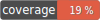

# Tinkoff Invest V1 rest client



This component implement's wrapper over guzzle http client for sending request to Tinkoff Invest V1.

Consist of:
- \rocketfellows\TinkoffInvestV1RestClient\Client - intended for direct sending of requests
- \rocketfellows\TinkoffInvestV1RestClient\ClientConfig - client configuration

## Client config
ClientConfig contains:
- **serverUrl** - which is common Tinkoff Invest V1 url, for example https://invest-public-api.tinkoff.ru/rest
- **accessToken** - Tinkoff Invest V1 access token which can be generated through the account settings of the Tinkoff Investments application

ClientConfig can be configured through DI from your environment params. For example:
for test environment of your application you can set **serverUrl** with Tinkoff Invest V1 sandbox, **accessToken** - with generated from Tinkoff Investments application for sandbox.

## Client

Client interface:

```php
public function request(string $serviceName, string $serviceMethod, array $data): array;
```

Where **$serviceName** for example **InstrumentsService** and **$serviceMethod** for example **GetDividends**.
Full list of available Tinkoff Invest V1 services and methods here https://tinkoff.github.io/investAPI/swagger-ui/

## Interface exceptions

\rocketfellows\TinkoffInvestV1RestClient\exceptions\request\ServerException - exception when a server error is encountered (5xx codes)
\rocketfellows\TinkoffInvestV1RestClient\exceptions\request\ClientException - exception when a client error is encountered (4xx codes)
\rocketfellows\TinkoffInvestV1RestClient\exceptions\request\HttpClientException - exception for other errors

Both ServerException and **ClientException** extends \rocketfellows\TinkoffInvestV1RestClient\exceptions\request\BadResponseException
which holds server error response data:
- \rocketfellows\TinkoffInvestV1RestClient\exceptions\request\BadResponseException::getErrorCode
- \rocketfellows\TinkoffInvestV1RestClient\exceptions\request\BadResponseException::getErrorMessage
- \rocketfellows\TinkoffInvestV1RestClient\exceptions\request\BadResponseException::getErrorDescription

Server error data response example:
```json
{
    "code": 3,
    "message": "missing parameter: 'figi'",
    "description": "30008"
}
```

## Component dependencies

"guzzlehttp/guzzle": "7.4.3" - https://github.com/guzzle/guzzle

## Usage example

```php
$client = new Client(
    (
        new ClientConfig(
            'https://invest-public-api.tinkoff.ru/rest',
            <your_access_token>
        )
    ),
    new \GuzzleHttp\Client()
);

$response = $client->request(
    'InstrumentsService',
    'GetDividends',
    [
        "figi" => "BBG004730RP0",
        "from" => "2022-05-28T15:38:52.283Z",
        "to" => '2022-08-18T15:38:52.283Z',
    ]
);

// response
array(1) {
  ["dividends"]=>
  array(1) {
    [0]=>
    array(9) {
      ["dividendNet"]=>
      array(3) {
        ["currency"]=>
        string(3) "rub"
        ["units"]=>
        string(2) "52"
        ["nano"]=>
        int(530000000)
      }
      ["declaredDate"]=>
      string(20) "2022-06-30T00:00:00Z"
      ["lastBuyDate"]=>
      string(20) "2022-07-18T00:00:00Z"
      ["dividendType"]=>
      string(0) ""
      ["recordDate"]=>
      string(20) "2022-07-20T00:00:00Z"
      ["regularity"]=>
      string(0) ""
      ["closePrice"]=>
      array(3) {
        ["currency"]=>
        string(3) "rub"
        ["units"]=>
        string(3) "297"
        ["nano"]=>
        int(0)
      }
      ["yieldValue"]=>
      array(2) {
        ["units"]=>
        string(2) "17"
        ["nano"]=>
        int(690000000)
      }
      ["createdAt"]=>
      string(27) "2022-06-06T02:04:47.759671Z"
    }
  }
}
```

## Contributing

Welcome to pull requests. If there is a major changes, first please open an issue for discussion.

Please make sure to update tests as appropriate.
